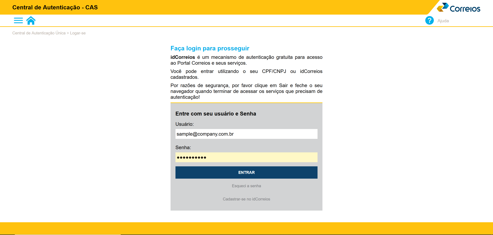
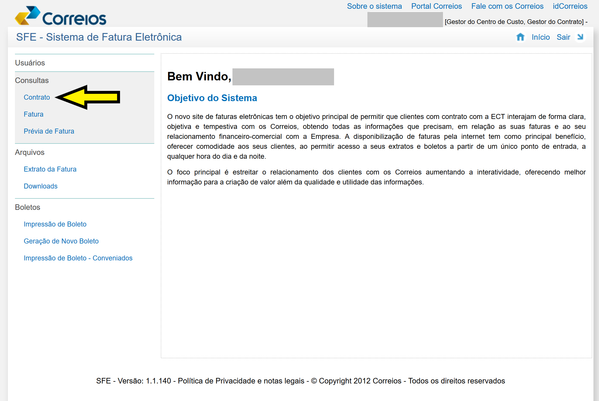
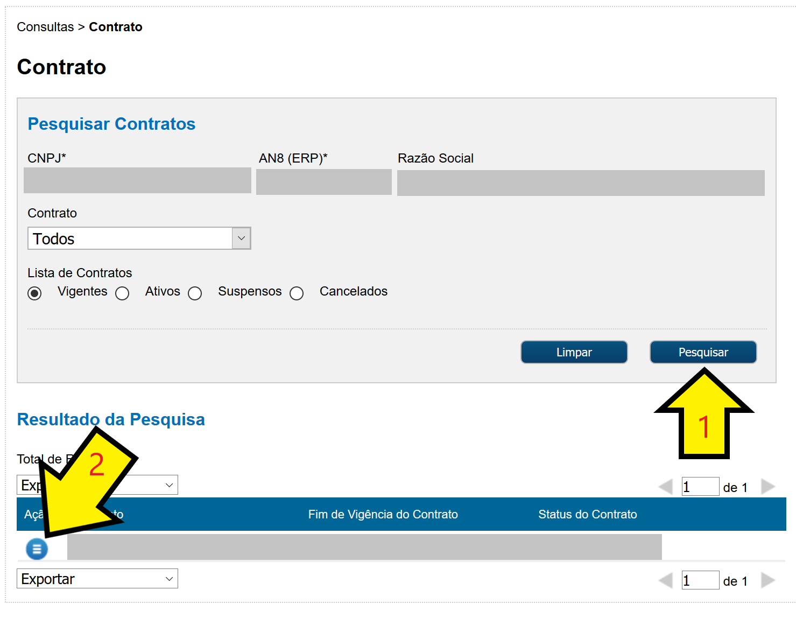
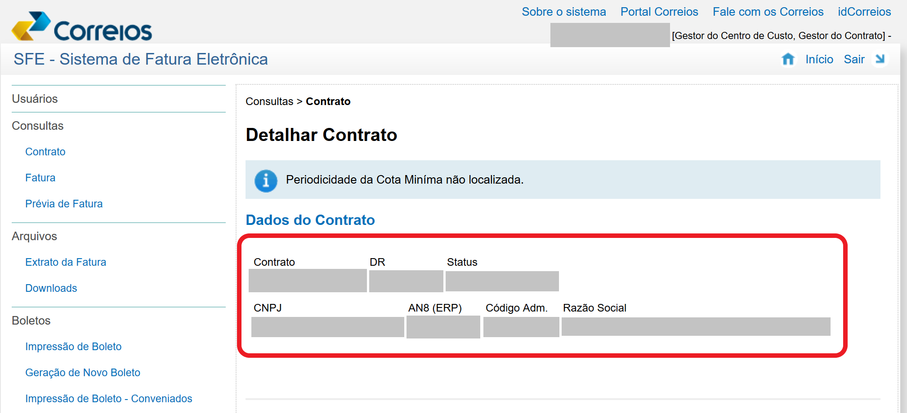
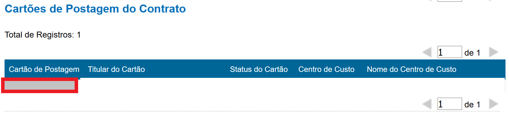

# SIGEPy
Operate the web services of brazilian post service, Correios, named SIGEP with Python.

## Usage
### Generate Delivery Post List (with tracking codes)
1. Load the company credentials;
2. Register a sender;
3. Register a receiver;
4. Add delivery's packages;
5. Generate pre-delivery data;
6. Generate posting list file;
7. Generate delivery labels file.

```python
from SIGEPy import *

""" STEP 1: Load the company credentials """
COMPANY_CREDENTIALS = {
    'usr': 'username',
    'pwd': 'password',
    'company_name': 'Company Name',
    'company_cnpj' : '99999999999999',
    'contract_regional_direction' : 99,
    'contract_number' : '9999999999',
    'contract_post_card_number' : '9999999999',
    'contract_admin_code' : '99999999',
}
sigepy = SIGEPy(**COMPANY_CREDENTIALS)

""" STEP 2: Register a sender """
SENDER_SAMPLE = {
    'name':'Generic people name',
    'street':'Street Sample 99',
    'number':'9999', 'city':'São Paulo', 'state':'SP',
    'zip_code':'99999-999', 'neighborhood':'Pinheiros',
    'complement':'Térreo',
    'phone':'9999999999',
}
sigepy.create_sender(**SENDER_SAMPLE)

""" STEP 3: Register a receiver """
RECEIVER_SAMPLE = {
    'name':'Generic people name 2',
    'street':'Street Sample 99',
    'number':'99', 'city':'São Paulo', 'state':'SP',
    'zip_code':'99999-999', 'neighborhood':'Vila Carrão',
    'complement':'Casa',
    'phone':'99999999999',
}
sigepy.create_receiver(**RECEIVER_SAMPLE)

""" STEP 4: Add delivery's packages """
PACKAGE_SAMPLE = {'package_type': Package.TYPE_ENVELOPE, 'weight':1, 'service':SERVICE_PAC}
sigepy.add_package(**PACKAGE_SAMPLE)
sigepy.add_package(**PACKAGE_SAMPLE)

""" STEP 5: Generate pre-delivery data """
sigepy.generate_pre_delivery_data()

""" STEP 6: Generate posting list file """
posting_list_pdf_filepath = 'posting_list.pdf'
sigepy.generate_delivery_posting_list_pdf(posting_list_pdf_filepath)

""" STEP 7: Generate delivery labels file """
delivery_labels_pdf_filepath = 'delivery_labels.pdf'
sigepy.generate_delivery_labels_pdf(delivery_labels_pdf_filepath)
```

### Generate Only Tracking codes
1. Load the company credentials;
2. Generate the tracking codes.

```python
from SIGEPy import *

""" STEP 1: Load the company credentials """
COMPANY_CREDENTIALS = {
    'usr': 'username',
    'pwd': 'password',
    'company_name': 'Company Name',
    'company_cnpj' : '99999999999999',
    'contract_regional_direction' : 99,
    'contract_number' : '9999999999',
    'contract_post_card_number' : '9999999999',
    'contract_admin_code' : '99999999',
}
sigepy = SIGEPy(**COMPANY_CREDENTIALS)

""" STEP 2: Generate the tracking codes """
service_type = SERVICE_PAC
quantity_of_tracking_codes = 5
sigepy.generate_tracking_codes(service_type, quantity_of_tracking_codes)
```


## Getting Company data
To use SIGEP, it is necessary to have a contract with the Post Office to log in to this system.  
The contract details are on the website: https://apps.correios.com.br/cas/login  

#### 1. Login in Company Home:

  
<br />

#### 2. In the Company home, click on Contract label, *Contrato* in brazilian Portuguese, as in the image below: 

  
<br />

#### 3. Select a Company's Contract  

3.1 Search company's contracts  
3.2 Select a company's contracts  

  
<br />

#### 4. Copy the company's contract data
The relevant data found on this page are circled in red:

* Contract's data
    
<br />

* PostCard number 
  
<br />  

* COMPANY_CREDENTIALS in this page:
    - company_name = *Razão Social*
    - company_cnpj = *CNPJ*
    - contract_regional_direction = *DR* (choose just one)
    - contract_number = *Contrato*
    - contract_admin_code = *Código Adm.*
    - contract_post_card_number = *Cartão de Postagem*
    
